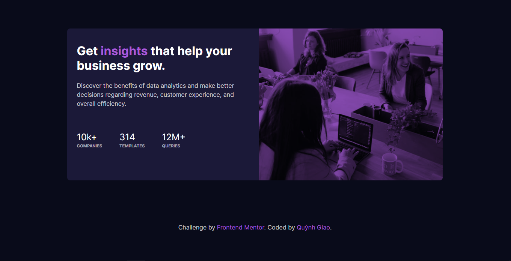

# Frontend Mentor - Stats preview card component solution

This is a solution to the [Stats preview card component challenge on Frontend Mentor](https://www.frontendmentor.io/challenges/stats-preview-card-component-8JqbgoU62). Frontend Mentor challenges help you improve your coding skills by building realistic projects. 

## Table of contents

- [Overview](#overview)
  - [The challenge](#the-challenge)
  - [Screenshot](#screenshot)
  - [Links](#links)
- [My process](#my-process)
  - [Built with](#built-with)
  - [What I learned](#what-i-learned)
  - [Useful resources](#useful-resources)

**Note: Delete this note and update the table of contents based on what sections you keep.**

## Overview

### The challenge

Users should be able to:

- View the optimal layout depending on their device's screen size

### Screenshot

- Desktop Preview:

- Mobile Preview:

### Feedback and Live Site

- Solution URL: [GitHub](https://github.com/giaonnq1401/Stats-preview-card-component)
- Live Site URL: [GitHub Pages](https://giaonnq1401.github.io/Stats-preview-card-component/)
- Give Feedback on [FrontendMentor](https://your-live-site-url.com)

## My process

### Built with

- Semantic HTML5 markup
- CSS custom properties
- Flexbox

### What I learned

- Using `background-blend-mode` property
- Learn how to use `CSS flex` property

### Useful resources

- [CSS flex Property](https://www.w3schools.com/cssref/css3_pr_flex.asp) - This helped me the way to use CSS flex.
- [CSS background-blend-mode Property](https://www.w3schools.com/cssref/pr_background-blend-mode.asp)
